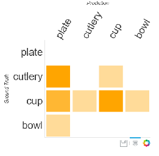

# Image Classification

This hands-on lab demonstrates the application of the Azure ML Computer Vision Package for image classification.

### Learning Objectives ###

The objectives of this lab are to:
- Understand the image classification workflow
- Learn how to format a dataset in order to ingest and perform augmentations
- Train a model using transfer learning based on ResNet18 and evaluate the classifier

### Data

In this lab, we will use the same sample classification dataset (resources/sample_data.zip) related to recyling dishes that was used in the previous lab.

### Execution

Launch Azure Machine Learning Workbench and open CLI by selecting File -> Open Command Prompt. The script to perform training and evaluation is `resources/train.py`. Execute the script by runing the below command and walk through the code:

```az ml experiment submit -c local train.py```

The main function that does training and evaluation is _classify_ in `train.py`. Ensure the argument _dataset_location_ points to the dataset folder provided in _resources/sample_data_.

You will also need to ensure that the _ui_utils_ folder that comes with the toolkit is in the same directory level as the script.

#### Dataset creation from directory

Create a dataset from a directory with folders representing different classes using the below function. You can also use _print_info()_ to obtain a detailed breakdown of the dataset.

````python
    dataset = ClassificationDataset.create_from_dir(dataset_name, dataset_location)
`````

#### Dataset splitting

The _cvtk_ package offers several utility functions to split the dataset into a train and test set. Additionally, the stratify option will ensure that the different labels are balanced in the train and test sets. In the below code snippet, the train and test sets are created using a 0.6/0.4 proportion and using the stratified option.

````python
    train_set_orig, test_set = dataset.split(train_size = 0.66, stratify = "label")
````

### Augmentation

To achieve good performance, deep networks require large amount of training data. Image augmentation artificially creates training images through different ways of processing or combinations of multiple processing, such as random rotation, shifts, shear and flips, etc.

Adding augmented images generally is optional and the recommendation is not to do so (but perhaps later when trying to improve the results) as this step can be quite expensive both in terms of space and time. In addition, CVTK does not cache the augmented images and hence, this would have to be rerun every single time.

In this lab, we will demonstrate how you can perform a few augmentations using the _augmenters_ module:

1. We will first horizontally flip half of the images.

2. We will crop images between 0 and 10 percent of their height/width.

````python
rotate_and_flip = augmenters.Sequential([augmenters.Affine(rotate=(-45, 45)), augmenters.Fliplr(.5)])

    aug_sequence = augmenters.Sequential([
        augmenters.Fliplr(0.5),             # horizontally flip 50% of all images
        augmenters.Crop(percent=(0, 0.1))  # crop images by 0-10% of their height/width
    ])
    train_set = augment_dataset(train_set_orig, [aug_sequence])

````

The resulting dataset will be twice as many as the original.

### Model Training

In this lab, we will use Deep Residual Learning for classification. Deep residual networks took the deep learning world by storm when Microsoft Research released [Deep Residual Learning for Image Recognition](https://arxiv.org/pdf/1512.03385.pdf). ResNets led to 1st-place winning entries in all five main tracks of the ImageNet and COCO 2015 competitions, covering image classification, object detection, and semantic segmentation.

The robustness of ResNets has since been proven by various visual recognition tasks and by non-visual tasks involving speech and language. Briefly, with ResNets, we explicitly reformulate the layers as learning residual functions with reference to the layer inputs, instead of learning unreferenced functions. The below snippet trains a ResNet model using transfer learning and computes accuracy on _test_set_.

````python
    lr_per_mb = [0.05]*7 + [0.005]*7 +  [0.0005]
    mb_size = 32
    input_resoluton = 224
    base_model_name = 'ResNet18_ImageNet_CNTK'
    model = CNTKTLModel(train_set.labels,
                       base_model_name=base_model_name,
                       image_dims = (3, input_resoluton, input_resoluton))

    num_epochs = 45
    mb_size = 32
    model.train(train_set, lr_per_mb = lr_per_mb, mb_size = mb_size)

    ce = ClassificationEvaluation(model, test_set, minibatch_size = mb_size, enable_logging = enable_logging)
    acc = ce.compute_accuracy()
````
We use a learning rate of `[0.05]*7 + [0.005]*7 + [0.0005]`. This corresponds to using an initial learning rate of 0.05 for the first 7 epochs, followed by a 10x reduced learning rate of 0.005 for another 7 epochs, and finally fine-tuning using a single epoch with a 100x reduced learning rate of 0.0005. 

Additionally, we also set the resolution to default value of 224x224 pixels and use ResNet-18 as the base model. On completion of the script execution, you will see the location of the trained model and accuracy as shown below:

```
Finished Epoch[14 of 15]: [Training] loss = 0.000187 * 82, metric = 0.00% * 82 0.668s (122.8 samples/s);
Learning rate per minibatch: 0.0005
Finished Epoch[15 of 15]: [Training] loss = 0.000171 * 82, metric = 0.00% * 82 0.679s (120.8 samples/s);
Stored trained model at .\outputs\model_trained\ImageClassification.model
```

### Evaluation

The accuracy and confusion matrix is printed after building the model.

````python
    print("Accuracy = {:2.2f}%".format(100*acc))
    cm  = ce.compute_confusion_matrix()
    print("Confusion matrix = \n{}".format(cm))
````

In addition, we can also use _ui_utils_ to visualize the confusion matrix by running:

````python
    cm_ui = ConfusionMatrixUI(cm, [l.name for l in test_set.labels])
    show(cm_ui.ui)
````

This will generate a confusion matrix image that you can view via a browser as illustrated in the following image. Note that when you execute your script via CLI, you will be prompted to open the image (captured in an html) in a browser. Similarly, we can also obtain precision, recall and thresholds for analysis of ROC. Using the below line, can you use the precision, recall and threshold lists to plot ROC?

````python
    precisions, recalls, thresholds = ce.compute_precision_recall_curve()
````




### Exercise

1. Can you use a deeper DNN such as ResNet-34 or ResNet-50 instead of the default ResNet-18 model? Evaluate the model.

2. What effect does increasing the minibatch size and decreasing the learning_rate have on the training time and accuracy?

3. (Optional) There are plenty of [online image datasets](http://clickdamage.com/sourcecode/cv_datasets.php) available for ingesting and training using Azure ML Computer Vision Package. Can you create (by setting the folder structure and formating) a small dataset using any of [online image datasets](http://clickdamage.com/sourcecode/cv_datasets.php) and integrate within the workflow?
