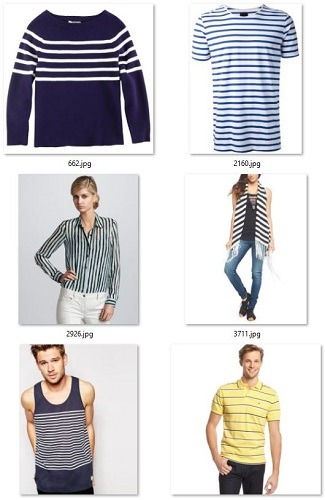
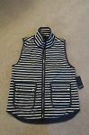
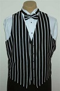
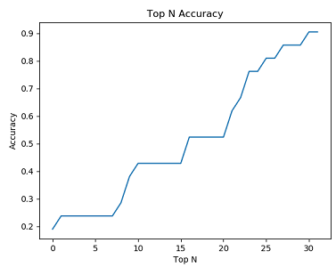
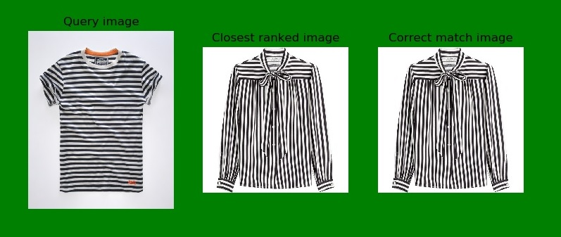
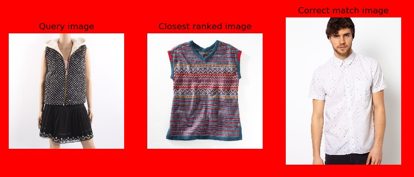

# Image Similarity

Image similarity involves fetching similar looking images given a reference image. Finding similar set of images for a given query image has multiple uses-cases from visual search to duplicate product detection to domain specific image clustering. This hands-on lab demonstrates the application of the Azure ML Computer Vision Package for image similarity. 

In this lab, we will:
- Download a set of images related to retail clothing (like those sold on an e-retail clothing site)
- Produce image pairs for training a ranking system
- Fine-tune a pre-trained model (_transfer learning_) using our own dataset
- Evaluate the image ranking system

### Learning Objectives ###

The objectives of this lab are to:
- Learn how to develop an image ranking system
- Use transfer learning to fine-tune a pre-trained model
- Learn how to validate the ranking system quantitatively and qualitatively

### Data

In this lab, we will first download a set of clothing images from a list of urls listed in _fashion_texture_urls.tsv_. Each image is annotated as one of 3 different textures (dotted, striped, leopard). The figure below shows examples for the attribute 'striped'.



All images were scraped using Bing Image Search and hand-annotated. It is important to note that the annotations were performed according to upper body clothing only. _fashion_texture_urls.tsv_ contains category and urls as shown below:

```
leopard	http://img1.etsystatic.com/006/0/7248068/il_570xN.379516279_ifsi.jpg

dotted	http://media-cache-ec0.pinimg.com/736x/49/b2/7c/49b27c1f1ceafef368c3218e278ef245.jpg

striped	http://rockstaracademy.co.uk/shop/Mens_t-shirt_white_black_BIG.jpg 
```

_download_images.py_ contains helper functions that allow us to download images from a set of urls. More specically, we will download the images from urls to a _dataset_location_ by running the below line:

````python
    download_images.download_all(dataset_location)
````

We can then create a dataset using the downloaded images located at _dataset_location_. _dataset_name_ is an arbitrary name for the dataset.

````python
    ClassificationDataset.create_from_dir(dataset_name, dataset_location)
````

The _cvtk_ package offers several utility functions to split the dataset into a train and test set. The stratify option will ensure that the different labels are balanced in the train and test sets. In the below code snippet, all images are assigned for either training or for testing - this split is mutually exclusive. Here we use a ratio of 0.5, 50% of the images from each attribute are assigned to training, and 50% to testing. 

````python
    splitter = Splitter(dataset)
    train_set, test_set = splitter.split(train_size = .5, random_state=1, stratify="label")
````

### Image Pairs

The concept of image pairs is used in developing a ranker. Image pairs are used to train and evaluate the image ranker. We select up to `num_train_sets=60` query images from each of the 3 attributes. Each query image is paired with one image from the same attribute, and up to `num_ref_images_per_set=50` images from other attributes. This leads to a maximum of 60*50 = 3000 mostly negative image pairs. 

````python
    num_train_sets = 60
    num_test_sets = 60
    num_different_label = 50
    trainPairs = ImagePairs(train_set, num_train_sets, num_different_label)
    testPairs = ImagePairs(test_set, num_test_sets, num_different_label)
````

Shown below are two positive image pairs for a given query image in the top row: 

  


### Model Training

#### Approach

Each pre-processed image is represented using the output of a DNN which was pre-trained on millions of images. The DNN takes as input the image itself, and the output is the penultimate layer which, for the ResNet-18 model used in this lab, consists of 512-floats. These 512-floats image representations are then scaled to each have an L2 norm of one, and the visual distance between two images is defined as a function of their respective 512-floats vectors. 

The below code snippet refines a pre-trained DNN using the training data obatained in the previous section.


````python
    refineDNN = True # Use the pretrained model as-is or refine
    model = CNTKTLModel(train_set.labels, class_map = {i: l.name for i, l in enumerate(dataset.labels)}, base_model_name='ResNet18_ImageNet_CNTK')
    if refineDNN:
        model.train(train_set)
````

Note that this can be slow even with a GPU. Hence, optionally, the pre-trained DNN can be used as-is. However, this can produce suboptimal image representations, and reduce ranker accuracy. You will see the following training related messages along with the location of the trained model on running `model.train(train_set)`

````
Finished Epoch[13 of 15]: [Training] loss = 0.363837 * 162, metric = 10.49% * 162 1.234s (131.3 samples/s);
Finished Epoch[14 of 15]: [Training] loss = 0.454747 * 162, metric = 11.11% * 162 1.295s (125.1 samples/s);
Learning rate per minibatch: 0.0005
Finished Epoch[15 of 15]: [Training] loss = 0.263069 * 162, metric = 9.26% * 162 1.254s (129.2 samples/s);
Stored trained model at .\outputs\model_trained\ImageClassification.model
````

#### Ranker

In this lab, we will use a couple of well-known distance metrics for computing similarity. Visual distance between two images is defined as a function of their respective 512-floats vectors.

_L2 distance_

A generalized term for the Euclidean norm is the L2 distance. It's basically an "ordinary" straight-line distance between two points in Euclidean space (with no weights added). The disadvantage however is that each of the 512 dimensions is assumed to carry the same amount of information which in practice is not true. 

_SVM-defined weighted disance_

SVM-defined weighted disance is a weighted Euclidean distance where the weights are estimated via Support Vector Machine (SVM). In this approach, we extract weight factor from SVMs to apply to the Euclidean distance measurement. In this way, retrieval could be more sensitive to the classification boundary and hence, can reduce misclassifications.

To use the ranker, first instantiate the image similarity ranker using the appropriate metric:


````python
    similarityMethod = "L2" # Options: "random", "L2", "svm"

    if similarityMethod == "random":
        ranker = ImageSimilarityRandomRanker()
    elif similarityMethod == "L2":
        ranker = ImageSimilarityMetricRanker(model, metric="L2")
    elif similarityMethod == "svm":
        from sklearn.svm import LinearSVC
        # SVM-defined weighted L2-distance. Need to train, but this is fast.
        svmLearner = LinearSVC(C = 0.01)
        ranker = ImageSimilarityLearnerRanker(model, learner=svmLearner)

    # Train the ranker, random and L2 do not need training and .train() will do nothing
    ranker.train(trainPairs)
````

### Evaluation

For quantitative evaluation, we will use image pairs obtained from the earlier step `testPairs = ImagePairs(test_set, num_test_sets, num_different_label)` where each query image is paired with 1 positive and 50 negative images (from different attributes). The 'reference' images are sorted using their distance to the query image, and the rank of the positive image is computed. Rank 1 corresponds to the best possible result and rank 51 is the worst. For example, the below lines of code produce the mean and median ranks of the positive images.

````python
    re = RankerEvaluation(ranker, testPairs)
    mean_rank = re.compute_mean_rank()
    median_rank = re.compute_median_rank()
````

The diagram below, after sorting, shows where the postive image has rank of 3 (note that this example uses 100 negative images):


The ranks for all query images can be aggregated into metrics such as the median or mean rank. However, aggregation rank metrics such as mean/median can be susceptible to outliers and should be taken with a grain of salt. In addition, you can also view ton N accuracy by running:
 ````python
    acc_plot = re.top_n_acc_plot(n=32, visualize=True)
```` 



### Visualization

For a given query image, you will find the closed ranked image and the correct match image. In the first row of the below image, you will notice that the top ranked image (closest ranked) and the correct match image are the same while it's different in the second row.





### Exercise

Can you find out which category of images (dotted, striped, leopard) produces the "best" ranks and can you intuitively explain this finding?
