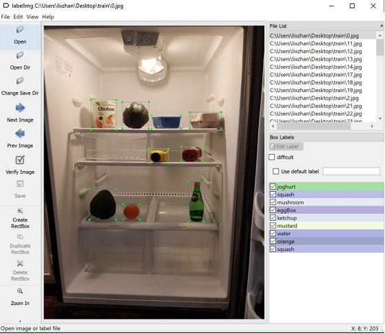
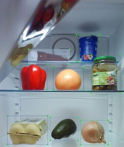
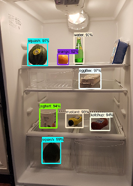
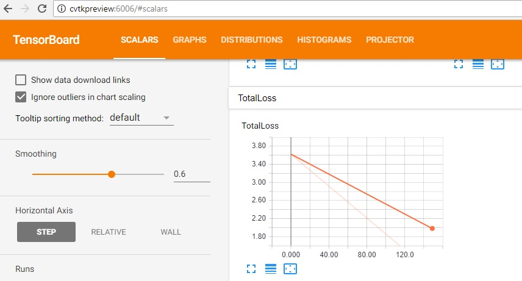

# Object Detection

Object detection is a process for identifying a specific object in a digital image. Specifically, detection is about not only finding the class of object but also localizing the extent of an object in the image. In recent times, Deep learning based methods have become the state of the art in object detection in image. They construct a representation in a hierarchial manner with increasing order of abstraction from lower to higher levels of neural network.


### Learning Objectives ###

The objectives of this lab are to:
- Learn how to create a dataset and it's format for object detection
- Learn how to train and evaluate an object detection model based on [Faster R-CNNs](https://arxiv.org/abs/1506.01497)
- Learn how to save the model and detect objects on new images

### Image Annotation

Annotated object locations are required to train and evaluate an object detector. To help draw bounding boxes is [LabelImg](https://tzutalin.github.io/labelImg) which can be installed using [windows_v1.6.0.zip](https://www.dropbox.com/s/tq7zfrcwl44vxan/windows_v1.6.0.zip?dl=1). LabelImg writes an xml-file per image in Pascal-VOC format, which can be read into CVTK: 



### Data

The dataset (resources\sample_data.zip) used in this lab consists of grocery items inside refrigerators. The dataset consists of 30 images, and 8 classes: `joghurt, squash, mushroom, eggBox, ketchup, mustard, water, orange`. The image training folder (sample_data\foods\train) contains two folders:

- Annotations

    The annotation files capture each object for the corresponding image (in JPEGImages folder) along with a bounding box that includes the top left corner and bottom right corner points. An example of an annotated image is illustrated below:

    

    At the time of developing this lab, support is present only for bounding boxes and not other shapes.

    ```
        <object>
                <name>tomato</name>
                <pose>Unspecified</pose>
                <bndbox>
                    <xmin>828</xmin>
                    <ymin>1068</ymin>
                    <xmax>982</xmax>
                    <ymax>1196</ymax>
                </bndbox>
        </object>
    ```

- JPEGImages

    The JPEGImages folder contains the raw jpg images. For each jpg image in the folder, an annotation xml-file with similar name exists in Annotations folder.

    In this lab, we will first create an "Object Detection Dataset" using the helper function _create_from_dir_pascal_voc_ that takes the image folder as an argument. The ObjectDetectionDataset object consists of a set of images, with their respective bounding box annotations.

    ````python
        image_folder = "C:\\path2sample_data\\foods\\train"
        data_train = ObjectDetectionDataset.create_from_dir(dataset_name='training_dataset',data_dir=image_folder, annotations_dir="Annotations", image_subdirectory='JPEGImages')
    ````


### Execution

To execute the detection.py script located in resources, launch Azure Machine Learning Workbench and open CLI by selecting File -> Open Command Prompt. Run the below command and walk through the code. The script would need to be edited to change the path references.

```az ml experiment submit -c local detection.py```

### Model Definition and Training

In this lab, we will use [Faster R-CNN](https://arxiv.org/abs/1506.01497), a significant improvement of R-CNNs for object detection. The basic idea from the first R-CNN paper is illustrated in the Figure below: (1) Given an input image, (2) in a first step, a large number candidate regions/proposals are generated. (3) These region proposals, are then each independently sent through the network which outputs a vector for each Region of Interest (ROI). Finally, (4) a classifier is learned which takes the ROI representation as input and outputs a label and confidence for each ROI. The ROI's are the objects detected. Fast R-CNN and Faster R-CNN addresses the limitation of R-CNN which is computationally very expensive (since the Neural Network is evaluated for each ROI).


To define the [Faster R-CNN](https://arxiv.org/abs/1506.01497) model, we will set _score_threshold_ and _max_total_detections_. _score_threshold_ is used for thresholding the detection score and _max_total_detections_ is used for the number of detections allowed. The larger the value, slower the training (but may increase accuracy).

````python
    score_threshold = 0.0
    max_total_detections = 300
    my_detector = TFFasterRCNN(labels=data_train.labels, 
                            score_threshold=score_threshold, 
                            max_total_detections=max_total_detections)
````

After the model is defined, we can train the object detector. Training on a GPU machine using the refrigerator dataset can take up to 5 minutes. The number or training steps in the code is set to 350, so that training runs quickly in about 5 minutes. In practice, this should be set to at least 10 times the number of images in the training set.

#### Training Parameters

Two key training parameters are number of steps and learning rates. The argument _num_steps_ is for specifying the number of minibatches used to train the model. Since the minibatch size is set to 1 in this release, it equals the number of images considered during training.

Two key parameters for training are:
- _number of steps_: number of minibatches used to train the model. Since the minibatch size is set to 1 in this release, it equals the number of images considered during training. 
- _learning rate_: how fast weights/coefficients change.

Below is an example snippet where the parameters are passed for training:

````python
    num_steps = 350
    learning_rate = 0.001 # learning rate

    start_train = time.time()
    my_detector.train(dataset=data_train, num_steps=num_steps, 
                    initial_learning_rate=learning_rate)
````

### Evaluation

We will first create a validation dataset first by calling the helper function _create_from_dir_ using the validation data as the argument:

````python
    image_folder = "C:\\path2sample_data\\sample_data\\foods\\test"
    data_val = ObjectDetectionDataset.create_from_dir(dataset_name='val_dataset', data_dir=image_folder)
````

Accuracy can be obtained for each category and overall using the below code:

````python
    eval_result = my_detector.evaluate(dataset=data_val)

    for label_obj in data_train.labels:
        label = label_obj.name
        key = 'PASCAL/PerformanceByCategory/AP@0.5IOU/' + label
        print('{0: <15}: {1: <3}'.format(label, round(eval_result[key], 2)))
        
    print('{0: <15}: {1: <3}'.format("overall:", round(eval_result['PASCAL/Precision/mAP@0.5IOU'], 2))) 
````

Accuracy metrics for each category looks as shown below. Notice the last category 'overall' that combines all the categories.

```
joghurt        : 1.0
squash         : 1.0
mushroom       : 1.0
eggBox         : 1.0
ketchup        : 1.0
mustard        : 1.0
water          : 1.0
orange         : 1.0
overall:       : 1.0
```
### Saving the model

To save the model to a particular path, run the below code and change the model_dir:

````python
    save_model_path = "C:\\path2model\\cvtk_output\\faster_rcnn.model"
    my_detector.save(save_model_path)
````

### Scoring

We can obtain labels, scores and coordinates of all the detected objects in the image using the below code. The dictionary _detections_dict_ contains object attributes including class, scores, and bounding box coordinates for each object. We also threshold to view objects with scores more than 0.5:

````python
    my_detector_loaded = TFFasterRCNN.load(save_model_path)
    detections_dict = my_detector_loaded.score(image_path)

    look_up = dict((v,k) for k,v in my_detector.class_map.items())
    n_obj = 0
    for i in range(detections_dict['num_detections']):
        if detections_dict['detection_scores'][i] > 0.5:
            n_obj += 1
            print("Object {}: label={:11}, score={:.2f}, location=(top: {:.2f}, left: {:.2f}, bottom: {:.2f}, right: {:.2f})".format(
                i, look_up[detections_dict['detection_classes'][i]], 
                detections_dict['detection_scores'][i], 
                detections_dict['detection_boxes'][i][0],
                detections_dict['detection_boxes'][i][1], 
                detections_dict['detection_boxes'][i][2],
                detections_dict['detection_boxes'][i][3]))    
            
    print("\nFound {} objects in image {}.".format(n_obj, image_path)) 
````

The attributes of each object are captured as follows:

```
Object 0: label=squash, score=0.99, location=(top: 0.73, left: 0.30, bottom: 0.84, right: 0.42)
Object 1: label=eggBox, score=0.98, location=(top: 0.41, left: 0.54, bottom: 0.48, right: 0.68)
Object 2: label=squash, score=0.97, location=(top: 0.27, left: 0.21, bottom: 0.37, right: 0.34)
Object 3: label=ketchup, score=0.95, location=(top: 0.62, left: 0.62, bottom: 0.68, right: 0.74)
Object 4: label=joghurt, score=0.95, location=(top: 0.58, left: 0.29, bottom: 0.67, right: 0.40)
Object 5: label=mustard, score=0.94, location=(top: 0.60, left: 0.45, bottom: 0.67, right: 0.57)
Object 6: label=water, score=0.93, location=(top: 0.24, left: 0.51, bottom: 0.36, right: 0.57)
Object 7: label=orange, score=0.92, location=(top: 0.32, left: 0.40, bottom: 0.37, right: 0.47)
```

The coordinate produced from the attributes are relative co-ordinates. Left/right needs to be multiplied with the image width to obtain the absolute co-ordinate. Similarly, top/bottom with the image height.

### Visualization

For a given query image, you can visualize the objects detected using _detection_utils.visualize_:

````python
    path_save = "C:\\path2save\\scored_image_preloaded.jpg"
    ax = detection_utils.visualize(image_path, detections_dict, path_save=path_save, image_size=(8, 12))
````

View the image saved to to see bounding boxes along with labels and scores as follows:



### Tensorboard

The computations associated for training a massive deep neural network can be fairly complex and confusing. TensorBoard will make this a lot easier to understand, debug, and optimize your TensorFlow programs. For example, TensorBoard is useful for visualizing TensorFlow graph and plot quantitative metrics about the execution of your graph.

To launch tensorboard,
1. Open CLI by selecting File -> Open Command Prompt
2. When you run the script, you will find the log dir in cli as follows:

    ```tensorboard logdir: C:\Users\usernmae\AppData\Local\Temp\cvtk_output\2018_04_25_05_09_40_faster_rcnn_resnet50\models\train```

    Make a note of the logdir as we will be using it in step 3.

3. Run `tensorboard --logdir=<logpath>`. For example:

    ```
    C:\path2cvpproject\cvp_project>tensorboard --logdir=C:\Users\miprasad\AppData\Local\Temp\cvtk_output\2018_04_25_04_09_22_faster_rcnn_resnet50\models\train

    TensorBoard 1.5.1 at http://cvtkPreview:6006 (Press CTRL+C to quit)
    ```

Notice the url (http://cvtkPreview:6006) that is displayed after you run tensorboard. You can open this url via a browser (Chrome or Firefox):



In the above image, you will notice that the loss is displayed for the first 300 steps that is defined in _num_steps = 300_. Similarly, you can visualize other metrics that are useful when building or optimizing your model performance.

### Exercise

1. Change the score threshold and visualize the objects on the query image.

2. Can you think of ways to segment the object from the bounding box?

3. Can you change the training parameters (for example, _num_steps_) and view metrics such as _log_loss_ via tensorboard? 
